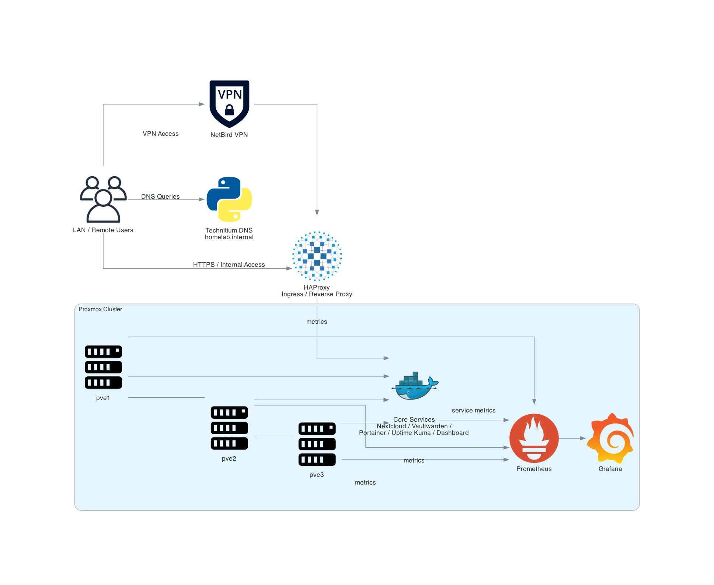
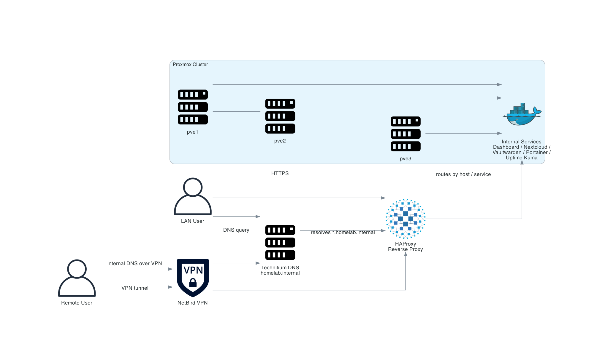
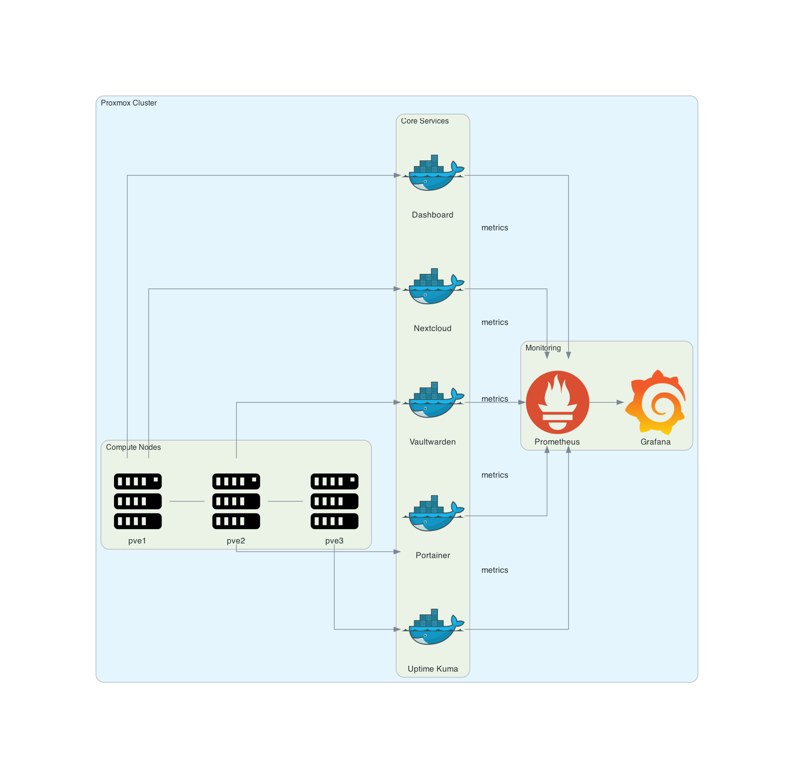
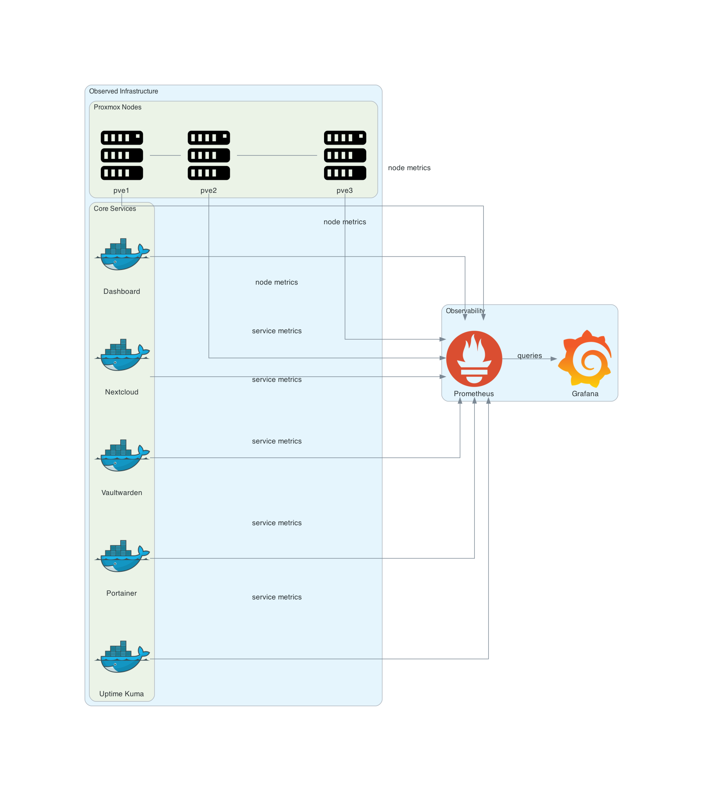

# 🚀 Self-Hosted Private Cloud

A **production-style, self-hosted private cloud platform** built on a Proxmox cluster, designed to replicate real-world cloud architecture patterns including **network segmentation, observability, GitOps evolution, and secure remote access**.

---

## 🧠 Architecture Overview

### High-Level Architecture


### Access & DNS Flow


### Internal Services Layout


### Monitoring Stack


### Platform Evolution (GitOps + Kubernetes + Hybrid Cloud)


---

## 🏗️ Core Architecture

### Compute Layer
- **Platform**: Proxmox VE cluster (`pve1`, `pve2`, `pve3`)
- Workloads distributed across nodes (VMs + LXCs)
- Designed for **high availability and Kubernetes readiness**

### Networking & Access
- **Gateway**: UDM Pro (VLANs, firewall, routing)
- **Internal DNS**: Technitium (`homelab.internal`)
- **Edge Proxy**: NGINX (reverse proxy, routing, TLS termination)
- **Remote Access**: Tailscale (secure VPN + subnet routing)

### Platform Services
- Central reverse proxy for all services
- Internal dashboard for service discovery
- DNS-based internal routing (`*.homelab.internal`)

### Observability Stack
- **Prometheus** → metrics collection
- **Grafana** → dashboards & visualization
- Exporters:
  - Node Exporter
  - Proxmox metrics exporter

### Application Services
- Nextcloud (private cloud storage)
- Portainer (container management)
- Uptime Kuma (service monitoring)
- Dashboard (internal landing UI)

---

## ⚙️ Platform Evolution (Roadmap)

The platform is designed to evolve into a **cloud-native, GitOps-driven system**:

- GitOps pipeline with **GitLab + Argo CD**
- Kubernetes cluster (Talos-based HA control plane)
- Containerized microservices deployment
- AI/Data Layer:
  - Ollama (LLM inference)
  - MLflow (experiment tracking)
  - MinIO (object storage)
- Hybrid cloud extension:
  - AWS EKS failover
  - Load-based traffic routing

---

## 📂 Repository Structure

```text
docs/                → Architecture diagrams, documentation, runbooks
infrastructure/      → Networking, Proxmox, Tailscale configs
inventory/           → IP plan, DNS records, host definitions
monitoring/          → Prometheus, Grafana, exporters
platform/            → DNS, edge proxy, Kubernetes configs
services/            → Application-level services (Nextcloud, etc.)
````

---

## 🚀 Deployment Approach (Documentation-First)

This repository follows a **structured infrastructure-first workflow**:

1. Define infrastructure:

   * `inventory/ip-plan.example.md`
   * `inventory/hosts.example.yml`

2. Configure DNS:

   * `inventory/dns-records.example.md`

3. Set up networking:

   * VLANs + firewall rules (`infrastructure/networking/`)

4. Deploy core platform services:

   * DNS
   * Reverse proxy
   * Dashboard

5. Enable observability:

   * Prometheus + Grafana (`monitoring/`)

6. Configure remote access:

   * Tailscale subnet router

---

## 🔐 Security Model

* **Zero Trust approach** (VPN-first access)
* Internal services are **not publicly exposed**
* Network segmentation using VLANs
* Least-privilege firewall policies
* No secrets committed (sanitized configs only)

---

## 📊 Design Principles

* Infrastructure as documentation
* Self-hosted over SaaS
* Observability-first architecture
* Kubernetes-ready design
* Security by default

---

## 📌 Status

🚧 Active development

Planned improvements:

* Full Kubernetes deployment
* GitOps CI/CD pipelines
* Hybrid cloud failover (AWS integration)
* Advanced monitoring + alerting

---

## 🎯 Purpose

This project demonstrates:

* Real-world **cloud architecture design**
* Hands-on **DevOps / SRE practices**
* **Self-hosted platform engineering**
* End-to-end system design:


