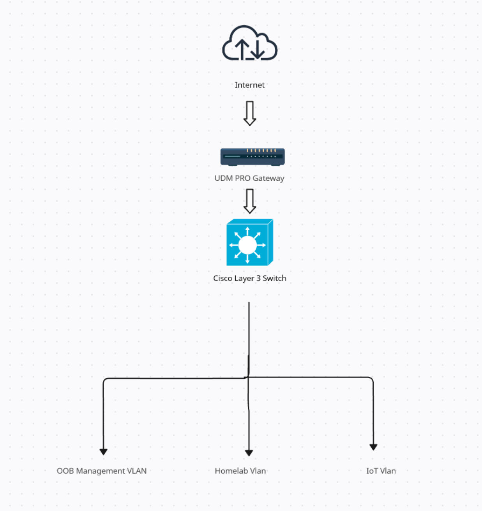

# VLANs (example)

## VLAN plan
- VLAN 20: OOB / Management (switch mgmt, IPMI/BMC, admin)
- VLAN 50: Homelab / Services
- VLAN 60: Test / Lab clients (optional)

## Trunking principles
- Trunk ports carry multiple VLANs tagged
- Access ports carry a single VLAN untagged

## Routing
- UDM Pro provides inter-VLAN routing (if allowed)
- Default: block inter-VLAN, allow only required flows

## Minimum required allows
- Admin VLAN -> Proxmox UI (8006) and SSH (22)
- Clients -> DNS (53) and edge proxy (80/443)
- Monitoring -> node_exporters (9100)

Document exact ports + switch config separately as needed.

