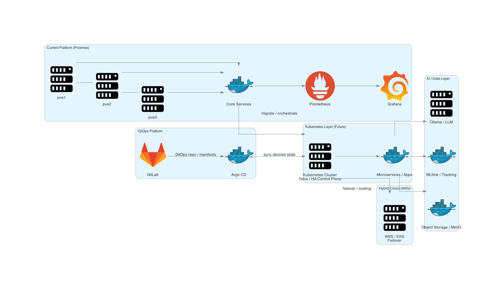

# Kubernetes Platform (GitOps Architecture)

This document describes the **Kubernetes layer and GitOps workflow** for the self-hosted private cloud platform.

---

## Platform Overview



The platform is evolving from a VM-based architecture (Proxmox) to a **cloud-native, Kubernetes-driven system** using GitOps principles.

---

## Kubernetes Architecture

### Cluster Type
- **Distribution**: Talos Linux (lightweight, immutable OS)
- **Topology**: High Availability (HA)

### Node Layout (Planned)

| Node Type        | Count | Description |
|-----------------|------|------------|
| Control Plane   | 3    | API server, scheduler, controller manager |
| Worker Nodes    | 3–6  | Application workloads |

Example mapping:
```text
pve1 → cp1 + workers
pve2 → cp2 + workers
pve3 → cp3 + workers
````

---

## GitOps Workflow

### Components

* **GitLab** → Source of truth (manifests, Helm charts)
* **Argo CD** → Continuous deployment engine

---

### Deployment Flow

```text
Developer → GitLab → Argo CD → Kubernetes Cluster
```

1. Code or config pushed to GitLab
2. Argo CD detects changes
3. Argo CD syncs desired state to cluster
4. Kubernetes applies changes automatically

---

## Workloads

Kubernetes will host:

* Microservices
* Web applications
* Internal tools
* AI/ML services

---

## Integrations

### Networking

* Ingress Controller (NGINX / Traefik)
* Internal DNS resolution via Technitium

### Storage

* Local storage (initial)
* Planned:

  * Longhorn / NFS
  * Distributed storage layer

### Monitoring

* Prometheus (extended to K8s)
* Grafana dashboards
* kube-state-metrics
* cAdvisor

---

## Security Model

* RBAC-based access control
* Namespace isolation
* Secrets management (planned)
* Network policies (future)

---

## Design Principles

* Declarative infrastructure (GitOps)
* Immutable infrastructure (Talos)
* Automated deployments
* High availability control plane
* Scalable workload management

---

## Migration Strategy

The platform will transition gradually:

1. Existing services (Docker / VM-based)
2. Containerization of workloads
3. Deployment into Kubernetes
4. Full GitOps-managed system

---

## Future Enhancements

* Service Mesh (Istio / Linkerd)
* Advanced CI/CD pipelines
* Multi-cluster management
* Hybrid cloud failover (AWS EKS)
* Autoscaling (HPA / Cluster Autoscaler)


